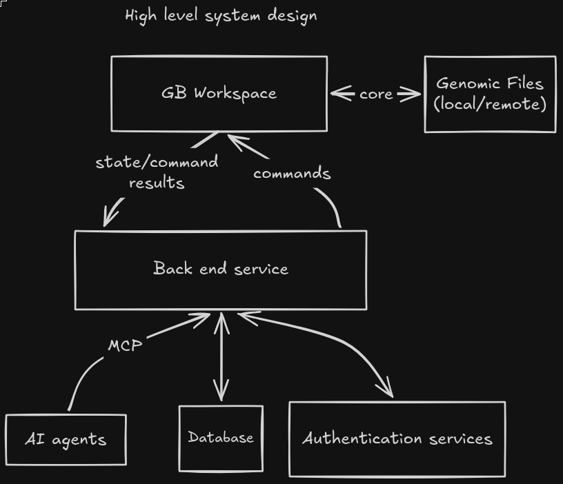

# January release plan

Ship both the cloud website and local `gb` app by January. Cloud is the priority because it is the easiest entry point for our users. Build the shared features locally first, while bringing up a small cloud deployment early.

This is the current proposal for the first release. The [reference notes](references/README.md) contain an earlier, more detailed exploration. Everything in those notes is open for debate; their larger feature list is not the release checklist. These pages describe intended behavior, not implementation status.

## System overview

The local and cloud versions share this structure. The [architecture](architecture.md) explains which parts run in each deployment.

## Release scope

| Experience | What users can do |
| --- | --- |
| Cloud guest | Open the browser without an account, explore curated track collections, and try heavily limited Eve chat. No session persistence. |
| Cloud account | Sign in through Clerk, save and reopen sessions, and use Eve with a larger allowance. |
| Local `gb` | Browse user data, load collection JSON, save local sessions, and use agents through MCP and ACP. No cloud account required. |

Local and cloud use nearly identical interfaces. A session contains one genome browser view. It saves browser state, track state, and basic metadata such as a name. Where imported collections are saved still needs a decision with the PIs.

Local `gb` can run on a laptop or lab server. For a remote machine, users open the same app through SSH port forwarding. Local and cloud sessions remain separate for this release.

## Later work and open scope

Agents should perform ordinary browser actions through the existing store functions, including adding and removing tracks. There are no per-action approval prompts for these tools in the initial release. More detailed agent permissions come later.

A collection editor, live synchronization between browser tabs, and local access to cloud sessions are outside the planned first iteration. Scientific analysis tools and embedding the browser inside other AI applications are also candidates for later work.

The timing of cloud custom-file uploads and collection JSON import is still open for discussion. See [open decisions](open-decisions.md) for the questions that need agreement.

## Read next

- [Architecture](architecture.md): responsibilities, shared UI, agents, sessions, and local files.
- [Delivery plan](delivery-plan.md): build order and checks for a usable release.
- [Open decisions](open-decisions.md): questions to resolve during implementation or with the PIs.

Keep decisions beside the design they affect. Add a separate decision record only when its reasoning needs more room than these pages provide.

[Back to maintainer docs](../README.md)
