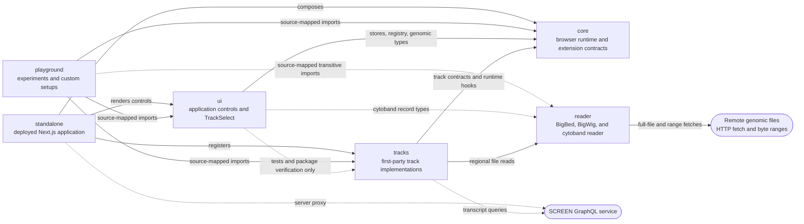
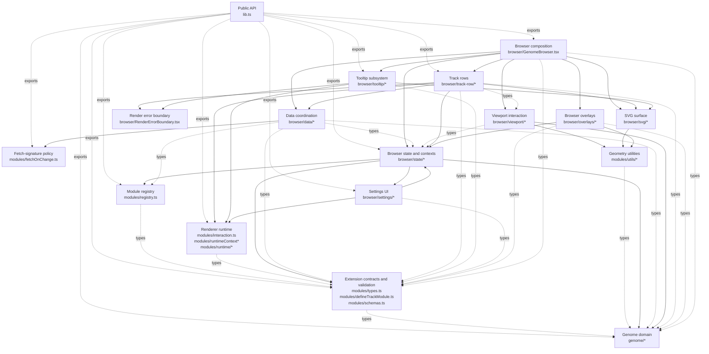
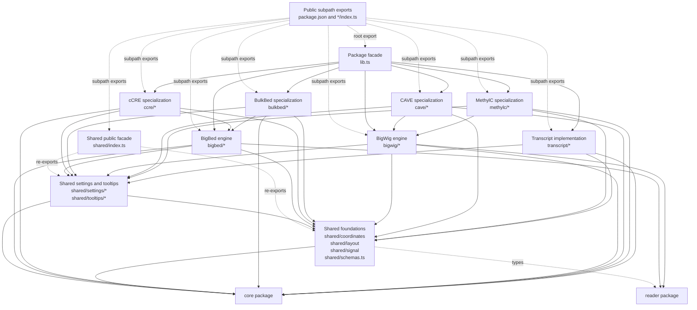
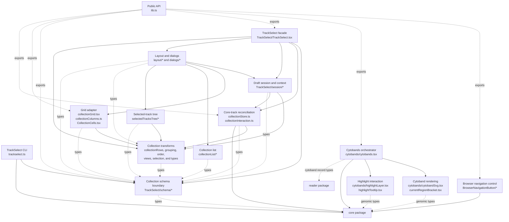
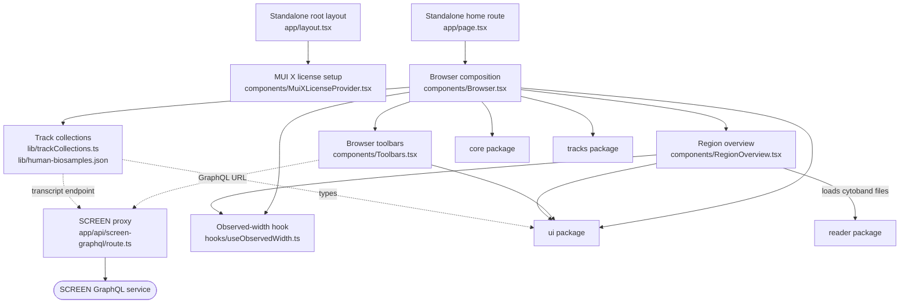
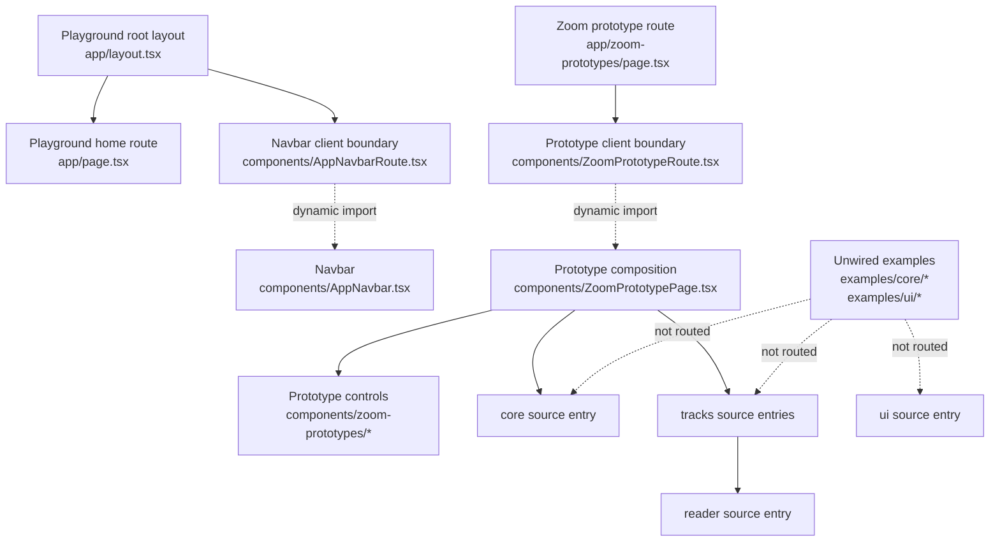
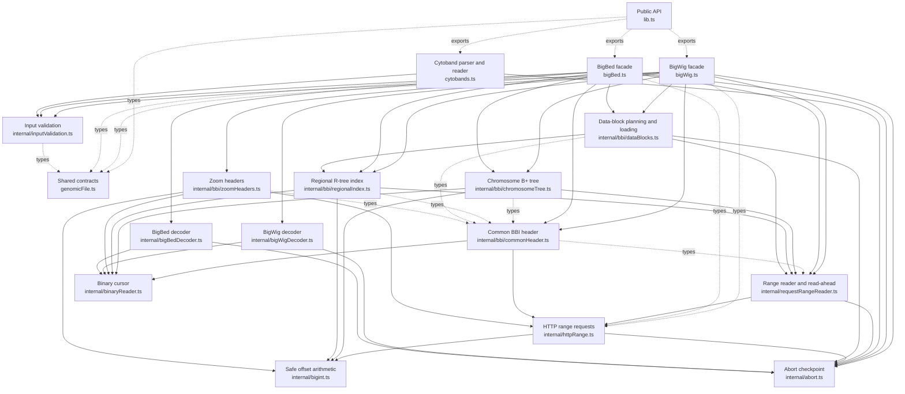

# Module dependency diagrams

These UML-style component diagrams show the static source dependencies inside
each package and the package-level architecture of the monorepo. A component is
a cohesive code subsystem, usually a source directory or a small group of files
with one responsibility. Individual files are grouped where a file-level graph
would obscure the architecture.

An arrow points from the consumer to the dependency. Solid arrows represent
runtime imports. Dashed arrows represent type-only imports, re-exports, dynamic
imports, or runtime URL connections, as labeled. External libraries are omitted
from package diagrams unless they define an important boundary.

## Monorepo

The production package graph is acyclic. `core` and `reader` are independent
foundations. `tracks` implements the extension contracts from `core` and uses
`reader`; `ui` controls `core` and uses `reader`'s cytoband record types; the
standalone app is the deployed composition root, while the playground consumes
source entries for experiments.

## Core package

Paths are relative to `packages/core/src`.

There is one source-level cycle around the default settings components:
`browser/state/settingsStore.ts` →
`browser/settings/DefaultBaseSettings.tsx` →
`browser/state/browserContextState.ts` →
`browser/state/settingsStore.ts`. The final edge is type-only, so the emitted
runtime graph remains acyclic. The notable coupling is that the state layer
chooses concrete default UI components.

## Tracks package

Paths are relative to `packages/tracks/src`. The nodes below describe code
subsystems, not the runtime meaning of a “track module.” Similar first-party
implementations are grouped to keep the dependency layers visible.

The local source graph has no static import cycle. Specialized implementations
depend on their format engine; the format engines never import a specialization.

## UI package

Paths are relative to `packages/ui/src`.

TrackSelect has a deliberate ownership boundary: draft selection state stays in
`session/*`; only submission reconciles that draft into the core track store.
There are two source-level, type-only cycles inside grouped nodes:
`highlightLayer.tsx` ↔ `highlightTooltip.tsx` and `collectionColumns.ts` ↔
`CollectionCells.tsx`. Neither is a runtime cycle.

## Applications

Standalone paths are relative to `apps/standalone`; playground paths are
relative to `apps/playground`.

The standalone graph is acyclic. Route modules point toward composition
components; compositions point toward leaf controls and workspace packages. The
API route is server-only and is connected to client code by URL, not by a source
import. `RegionOverview` owns the cytoband file read and passes ready records to
the UI renderer; the API route remains the server boundary for SCREEN requests.

The playground's Turbopack aliases and TypeScript paths map every public
workspace package entry, including track subpaths and the reader, to source.
The examples remain outside the route graph until a maintainer explicitly wires
one for an investigation.

## Reader package

Paths are relative to `packages/reader/src`.

The reader graph is acyclic and layered: public facades orchestrate format
reads; BBI structures and decoders sit below them; range transport and binary
primitives form the foundation.

## Maintenance notes

These diagrams were derived from static imports, re-exports, package manifests,
and the app's observed URL connections. Update them when a source dependency
crosses one of the shown subsystem or package boundaries. Internal edits that do
not change a boundary do not require a diagram change.
